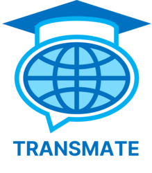
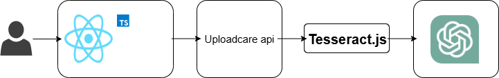

# Transmate
 
학습자료 번역 도우미 Transmate

# 프로젝트 소개
**Transmate는 학습자료 영번역기입닏다.** 
영어로 된 학교자료, 논문, 책 등의 이미지를 업로드하면 한국어 해석이 가능합니다.

**Transmate는 훌륭한 학습 도우미입니다.** 
업로드한 학습자료와 관련된 질문을 하면 답변이 가능하고 추가적인 정보가 있을 경우 이를 제공해 줍니다.

# 기술 스택

# Architecture

- **Frontend**: React, TypeScript
- **OCR**: Tesseract.js (브라우저 기반 OCR)
- **Image Upload**: Uploadcare API
- **LLM API**: Deepseek API (질문/응답 처리)

# 시연 화면
_(1).gif)
